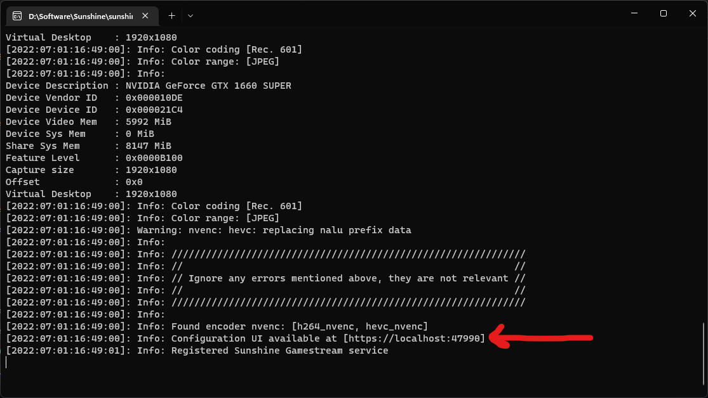

Want to play in your PC remotely? Even away from home? Then follow this tutorial to setup Sunshine as a streaming server, and Moonlight as a streaming client.

[nVidia GameStream](https://www.nvidia.com/en-us/support/gamestream/) is technology that allows you to play on your Windows + nVidia GPU + GeForce Experience setup remotely using and nVidia Shield, and it's awesome.

What's more awesome is that some kind people in the internet have been able to reverse engineer this, and create [Moonlight](https://moonlight-stream.org/), an Open Source implementation of a Shield client! So you're able to play from another device (PC, Phone, or even TV!) as if it were an nVidia Shield!

And if you don't want to or can't install GeForce Experience, some other kind people created [Sunshine](https://sunshinestream.github.io/), an Open Source implementation of an nVidia Gamestream server! And this one is able to run not only on windows, but also linux and macOS, too, with nVidia, AMD, or even Intel GPUs.

I'm going to cover the Windows setup here. Please visit the corresponding tools websites if you want more info.

# Requirements

As we're covering Windows, you should install [ViGEm Bus Driver](https://github.com/ViGEm/ViGEmBus) if you plan to connect using a controller (also Open Source Software).

# Sunshine Setup

Just download the zip file and extract the files to a known location (in my case: `D:\Software\Sunshine`)

Then double click `sunshine.exe` and it should open a terminal window. After displaying some info, hopefully you should see something like this:



Notice the URL at the bottom next to the BIG RED ARROW. That's the web UI address where you'll be able to further setup Sunshine. When logging in, it will ask you to create an administrator user:


As always, **try not to lose these credentials**.

# Moonlight Setup

Just get the zip or installable exe file, and run moonlight. You should see the host you setup in the previous step:


When you click on it, it will ask you to input a PIN in your Sunshine Server:


Now go to your sunshine web UI and go to PIN:


And input the PIN you saw on your Moonlight Client:


And now you should be able to connect from Moonlight client!


# Troubleshooting

## Moonlight is unable to find my sunshine server, which is running correctly!

It's probably blocked by the firewall settings. Go to Firewall Settings and check if it's enabled correctly:


If you've only enabled it for private (as in the picture), make sure your network is on private mode too!


## Ok, I can see the server, but it asks me to enable some ports? WTF?

It seems you don't have UPNP enabled in your router. If so, I recommend this:

1. Set your windows pc to a static IP
2. Port forward both `UDP 47998` and `UDP 48000` ports to your windows PC
3. Now you should be able to connect succesfully :)

## Cool! Now how do I set it up so it runs in the background FOREVERRR?

You can set it up as a windows service! Just run a terminal window as Administrator, and run these commands (making sure you replace the location of the sunshine folder!):

```powershell
$sunshine_path = "D:\Software\Sunshine"

sc create Sunshine binPath="$sunshine_path\tools\sunshinesvc.exe" displayname="Sunshine game streaming service" start=auto

sc description Sunshine "Sunshine game streaming server setup as a windows service"

net start Sunshine
```

## All right, all right, all right!, but it only works on my home network! How can I use it from somewhere else?

I recommend[^1] using [Tailscale](https://tailscale.com/), which gives you a personal VPN free for personal use between your devices.

1. Install Tailscale on your Windows **Sunshine Server** and connect to it.
2. Install Tailscale where the **Moonlight client** is, and connect to it. Make sure you're not on the same network to prove this works! (connect from another house, or using your phone connection)
3. After connecting from the **Client Device**, you should be able to see the name and IP address of the windows server on Tailscale. Take note of this IP address!
4. Open **Moonlight Client**
    1. Select "Add Host Manually"
    2. Paste the Tailscale IP address of the Windows host in the prompt, and continue.
    3. You should see a `Host information updated` message confirming everything went smoothly.
5. Now you should be able to connect to your Windows machine from the internet using Tailscale as a VPN!

[^1]: While it's true that [Moonlight Internet Hosting Tool](https://github.com/moonlight-stream/Internet-Hosting-Tool) exists, it only enables GeForce Experience to be available through the internet using UPNP routers.
